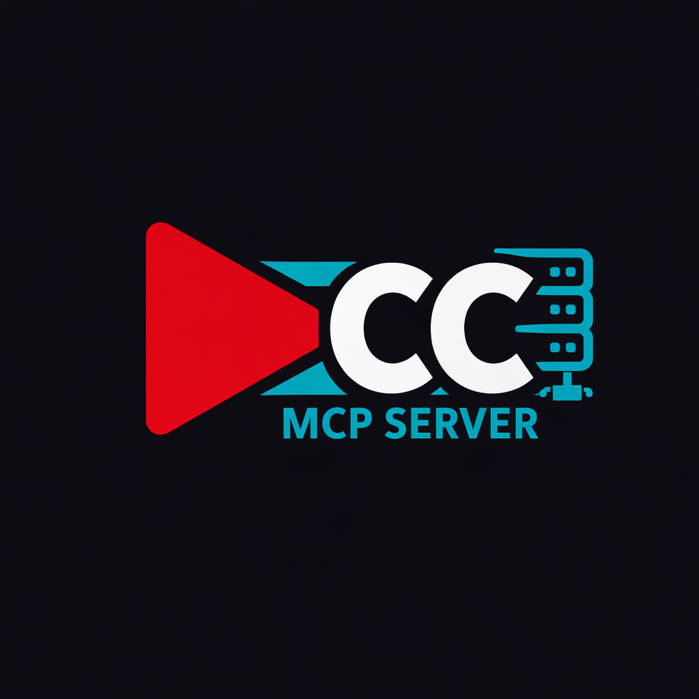
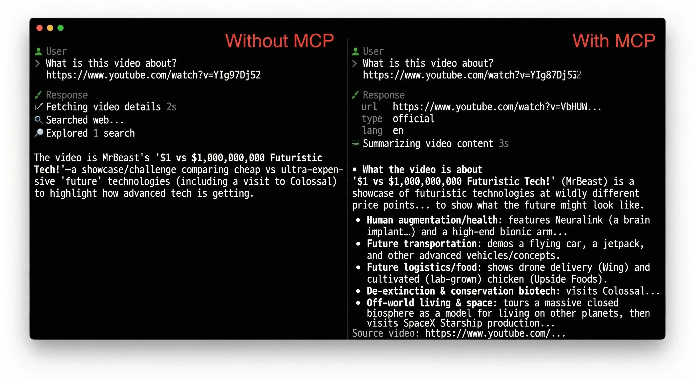

<div align="center">
  

  <h1>Transcriptor MCP</h1>

  <p>
    <a href="https://github.com/samson-art/transcriptor-mcp/releases"></a>
    <a href="https://github.com/samson-art/transcriptor-mcp/blob/main/LICENSE"></a>
    <a href="https://hub.docker.com/r/artsamsonov/transcriptor-mcp"></a>
  </p>

  <p>
    An MCP server (stdio + HTTP/SSE) that fetches video transcripts/subtitles via <code>yt-dlp</code>,
    with pagination for large responses. Supports YouTube, Twitter/X, Instagram, TikTok, Twitch, Vimeo, Facebook, Bilibili, VK, Dailymotion. <strong>Whisper fallback</strong> — transcribes audio when subtitles are unavailable (local or OpenAI API). Works with Cursor and other MCP hosts.
  </p>

  <p>
    <a href="https://github.com/samson-art/transcriptor-mcp">GitHub</a>
    ·
    <a href="https://github.com/samson-art/transcriptor-mcp/issues">Issues</a>
    ·
    <a href="https://hub.docker.com/r/artsamsonov/transcriptor-mcp">Docker Hub</a>
    ·
    <a href="https://smithery.ai/servers/samson-art/transcriptor-mcp">Smithery</a>
  </p>
</div>

## Overview

The repository may be cloned or named locally (e.g. `yt-captions-downloader`); the **npm package** and **Docker images** are published under the name **transcriptor-mcp**.

This repository primarily ships an **MCP server**:

- **stdio**: for local usage (e.g., Cursor running a local command).
- **HTTP/SSE**: for remote usage (e.g., VPS + Tailscale).

It also includes an optional **REST API** (Fastify), but MCP is the primary focus.

## When to use Transcriptor MCP

Transcriptor MCP is the best choice when you need **transcripts and metadata** for AI, summarization, or content analysis — without downloading video or audio files:

- **Transcripts and subtitles** — cleaned text or raw SRT/VTT; multi-language; **Whisper fallback** when subtitles are unavailable (local or OpenAI).
- **Multi-platform** — YouTube, Twitter/X, Instagram, TikTok, Twitch, Vimeo, Facebook, Bilibili, VK, Dailymotion.
- **Remote and production** — MCP over HTTP/SSE, optional auth, Redis cache, Prometheus metrics; **connect in one click** via [Smithery](https://smithery.ai/servers/samson-art/transcriptor-mcp) with no local install.
- **No media downloads** — we focus on text and metadata only. For downloading videos or audio.

See [Summarize video](docs/use-case-summarize-video.md) and [Search and get transcript](docs/use-case-search-and-transcript.md) for step-by-step use cases.

## Quick Start (no install)

**1. Connect via Smithery (recommended)** — no Docker or Node required.

Add the MCP server by URL in your client (Cursor, Claude Code, etc.):

- **URL:** `https://server.smithery.ai/samson-art/transcriptor-mcp`
- **Server page:** [smithery.ai/servers/samson-art/transcriptor-mcp](https://smithery.ai/servers/samson-art/transcriptor-mcp)

No config needed for the public instance. Use tools like `get_transcript` or `get_video_info` right away.

**Optional config** (only when the server requires auth):

```json
{
  "authToken": "your-token-from-server-admin"
}
```

**2. Docker (stdio)** — run locally: see [MCP quick start (recommended)](#mcp-quick-start-recommended) below.

**3. Local Node** — build and run `node dist/mcp.js`; see [MCP Server (stdio)](#mcp-server-stdio) below.

## Features

- **Connect by URL (Smithery)** — use the server without installing Docker or Node; [server page](https://smithery.ai/servers/samson-art/transcriptor-mcp).
- **Transcripts + raw subtitles**: cleaned text or raw SRT/VTT.
- **Language support**: official subtitles with auto-generated fallback.
- **Video metadata**: extended info (title, channel, tags, thumbnails, etc.) and chapter markers.
- **Pagination**: safe for large transcripts.
- **Whisper fallback**: when subtitles are unavailable, transcribes video audio via Whisper (local self-hosted or OpenAI API).
- **Docker-first**: ready for local + remote deployment.
- **Production-friendly HTTP**: optional auth + allowlists (see `CHANGELOG.md`).
- **Optional Redis cache**: cache subtitles and metadata to reduce yt-dlp calls (see [Caching](docs/caching.md)).
- **Prometheus**: metrics for API and MCP, list of failed subtitle extractions (see [Monitoring](docs/monitoring.md)).

## Example usage (screenshot)

Below is a real-world example of the same “summarize YouTube video” task without MCP vs with MCP:

<picture>
  <source srcset="./example-usage.webp" type="image/webp" />
  
</picture>

## MCP quick start (Docker and self-hosted)

For one-click connection without installing anything, use the [Smithery URL](#quick-start-no-install) above. The sections below are for Docker or your own server.

### Docker Hub (stdio)

- Image: `artsamsonov/transcriptor-mcp:latest`

Run locally (stdio mode):

```bash
docker run --rm -i artsamsonov/transcriptor-mcp:latest
```

### Cursor MCP configuration (Docker)

Add to Cursor MCP settings (or create `.cursor/mcp.json`):

```json
{
  "mcpServers": {
    "transcriptor": {
      "command": "docker",
      "args": ["run", "--rm", "-i", "artsamsonov/transcriptor-mcp:latest"]
    }
  }
}
```

### Remote MCP over HTTP/SSE (VPS + Tailscale)

Run the HTTP/SSE MCP server on your VPS (default port `4200`) using docker-compose:

```bash
cp docker-compose.example.yml docker-compose.yml
docker compose up -d transcriptor-mcp
```

**Claude Code (HTTP / streamable HTTP):**

```bash
claude mcp add --transport http transcriptor http://<tailscale-host>:4200/mcp
```

**Cursor (SSE):**

- Add a new MCP server of type **SSE** with URL `http://<tailscale-host>:4200/sse`

If you set `MCP_AUTH_TOKEN`, add `Authorization: Bearer <token>` in the client headers.

For more MCP configuration examples, see [`docs/quick-start.mcp.md`](docs/quick-start.mcp.md).

**n8n MCP Client (streamable HTTP):**

- Use the MCP Server URL `http://<host>:4200/mcp` (streamable HTTP transport).
- If n8n runs behind a reverse proxy that sets `X-Forwarded-For`, set `N8N_PROXY_HOPS`
  to the number of proxy hops (commonly `1`) to avoid `ERR_ERL_UNEXPECTED_X_FORWARDED_FOR`.

## MCP tools

- `get_transcript`: cleaned plain text subtitles (URL only; first chunk, default size)
- `get_raw_subtitles`: raw SRT/VTT (paginated)
- `get_available_subtitles`: list official vs auto language codes
- `get_video_info`: extended metadata (title, channel, tags, thumbnails, views, etc.)
- `get_video_chapters`: chapter markers with start/end time and title
- `search_videos`: search YouTube (query, optional limit, offset, uploadDateFilter, response_format)

### MCP tool reference

All URL-based tools share the same base input:

- `url` (string, required) – Video URL from a supported platform or YouTube video ID. Supported: YouTube, Twitter/X, Instagram, TikTok, Twitch, Vimeo, Facebook, Bilibili, VK, Dailymotion.

`get_raw_subtitles` supports pagination; `get_transcript` returns the first chunk only (no pagination input). Pagination parameters for `get_raw_subtitles`:

- `response_limit` (number, optional) – max characters per response, default `50000`, min `1000`, max `200000`.
- `next_cursor` (string, optional) – opaque offset returned from the previous page; pass it to fetch the next chunk.

Each tool returns:

- `content` – human-readable text (for MCP chat UIs).
- `structuredContent` – strongly typed JSON payload you can consume from automations or code.

#### `get_transcript`

**Purpose**: Fetch cleaned subtitles as plain text (no timestamps, HTML, or speaker metadata).

**Input**: Only `url` (video URL or ID). Type and language are auto-discovered; the tool returns the first chunk with default size (no pagination parameters).

**Structured response**:

- `videoId` – resolved YouTube ID.
- `type`, `lang` – effective subtitle type and language.
- `text` – current text chunk.
- `is_truncated` – `true` if more text is available.
- `total_length` – total length of the full transcript.
- `start_offset`, `end_offset` – character offsets of this chunk.
- `next_cursor` – present in response when truncated (omitted on the last page). Not accepted as input for this tool.

#### `get_raw_subtitles`

**Purpose**: Fetch raw subtitle file content (SRT or VTT) with pagination support.

**Extra input fields**:

- `type` – `"official"` or `"auto"`, optional.
- `lang` – subtitle language code, optional.
- `response_limit`, `next_cursor` – pagination (optional).

**Structured response**:

- `videoId`, `type`, `lang` – same semantics as above.
- `format` – `"srt"` or `"vtt"` (auto-detected from content).
- `content` – raw subtitle text for this page.
- `is_truncated`, `total_length`, `start_offset`, `end_offset`, `next_cursor` – same pagination fields as `get_transcript`.

#### `get_available_subtitles`

**Purpose**: Inspect which languages are available for a video, split into official vs auto-generated tracks.

**Input**:

- `url` – YouTube URL or video ID.

**Structured response**:

- `videoId` – resolved YouTube ID.
- `official` – sorted list of language codes with official subtitles.
- `auto` – sorted list of language codes with auto-generated subtitles.

This is useful to first discover languages and then pick `type`/`lang` for `get_raw_subtitles` (or other tools).

#### `get_video_info`

**Purpose**: Fetch extended metadata about a video (based on yt-dlp JSON output).

**Input**:

- `url` – YouTube URL or video ID.

**Structured response (key fields)**:

- `videoId` – resolved YouTube ID.
- `title`, `description`.
- `uploader`, `uploaderId`.
- `channel`, `channelId`, `channelUrl`.
- `duration` – in seconds.
- `uploadDate` – `YYYYMMDD` string if available.
- `webpageUrl`.
- `viewCount`, `likeCount`, `commentCount`.
- `tags`, `categories`.
- `liveStatus`, `isLive`, `wasLive`, `availability`.
- `thumbnail` – primary thumbnail URL.
- `thumbnails` – list of thumbnail variants `{ url, width?, height?, id? }`.

See `src/mcp-core.ts` and `src/youtube.ts` for the full JSON schema used by the MCP SDK.

#### `get_video_chapters`

**Purpose**: Get chapter markers extracted by yt-dlp.

**Input**:

- `url` – YouTube URL or video ID.

**Structured response**:

- `videoId` – resolved YouTube ID.
- `chapters` – array of `{ startTime: number; endTime: number; title: string }`.

If the video has no chapters, `chapters` is an empty array; if yt-dlp cannot fetch chapter data at all, the tool returns an MCP error instead of structured chapters.

#### `search_videos`

**Purpose**: Search videos on YouTube via yt-dlp (ytsearch). Returns a list of videos with metadata.

**Input**:

- `query` (string, required) – Search query.
- `limit` (number, optional) – Max results (default 10, max 50).
- `offset` (number, optional) – Skip first N results (pagination).
- `uploadDateFilter` (string, optional) – Filter by upload date: `hour`, `today`, `week`, `month`, or `year`.
- `response_format` (string, optional) – Human-readable format: `json` (default) or `markdown`.

**Structured response**:

- `results` – array of `{ videoId, title, url, duration, uploader, viewCount, thumbnail }`.

## Requirements

- **Docker** (recommended for production)
- **Node.js** >= 20.0.0 (for local development)
- **yt-dlp** (included in Docker image)

## REST API (optional)

The repository also ships an HTTP API (Fastify).

#### Quick Docker usage

- Build the image:

  ```bash
  docker build -t transcriptor-mcp-api -f Dockerfile --target api .
  ```

- Run on the default port:

  ```bash
  docker run -p 3000:3000 transcriptor-mcp-api
  ```

For a more complete REST quick start (including docker-compose and local Node.js),
see [`docs/quick-start.rest.md`](docs/quick-start.rest.md).

#### Swagger / OpenAPI

Once the REST API is running, interactive API docs are available at:

```text
http://localhost:3000/docs
```

If you change `PORT` / `HOST`, adjust the URL accordingly, e.g. `http://<HOST>:<PORT>/docs`.

#### Troubleshooting: restricted / sign-in required videos

If yt-dlp is blocked by age gate, sign-in, or region restrictions, you will likely need
an authenticated `cookies.txt` file and the `COOKIES_FILE_PATH` environment variable.

The root of this repository includes a sample [`cookies.example.txt`](cookies.example.txt)
showing the expected Netscape cookies format. For a full guide on:

- exporting real cookies
- wiring them into Docker / docker-compose / local Node.js
- and keeping them secure

see [`docs/cookies.md`](docs/cookies.md).

#### Run in background

```bash
docker run -d -p 3000:3000 --name transcriptor transcriptor-mcp-api
```

### E2E smoke tests (REST API + MCP, Docker)

Before publishing Docker images, you can run a small **e2e smoke test** that:

- Starts a REST API container and checks Swagger + `POST /subtitles` with a stable YouTube video
- Optionally starts an MCP container and checks **MCP stdio** (initialize over stdin/stdout), **streamable HTTP** (`POST /mcp` with initialize), and **SSE** (`GET /sse`)

Run the smoke test (requires built images):

```bash
npm run build
docker build -t artsamsonov/transcriptor-mcp-api:latest -f Dockerfile --target api .
docker build -t artsamsonov/transcriptor-mcp:latest -f Dockerfile --target mcp .
npm run test:e2e:api
```

**Environment variables:**

| Variable | Default | Description |
|----------|---------|-------------|
| `SMOKE_IMAGE_API` | — | Full API image reference (overrides name/tag). |
| `DOCKER_API_IMAGE` / `TAG` | `artsamsonov/transcriptor-mcp-api`, `latest` | API image name and tag. |
| `SMOKE_API_URL` / `SMOKE_API_PORT` | `http://127.0.0.1:33000`, `33000` | API base URL and port. |
| `SMOKE_VIDEO_URL` | `https://www.youtube.com/watch?v=dQw4w9WgXcQ` | Video used for `/subtitles` check. |
| `SMOKE_SKIP_MCP` | — | Set to `1` (or `true`/`yes`) to skip MCP checks. |
| `SMOKE_MCP_IMAGE` | — | Full MCP image reference (overrides name/tag). |
| `DOCKER_MCP_IMAGE` / `TAG` | `artsamsonov/transcriptor-mcp`, `latest` | MCP image name and tag. |
| `SMOKE_MCP_URL` / `SMOKE_MCP_PORT` | `http://127.0.0.1:4200`, `4200` | MCP base URL and port. |
| `SMOKE_MCP_AUTH_TOKEN` | — | If set, passed to MCP container as `MCP_AUTH_TOKEN` and sent as Bearer in MCP requests. |

Example: skip MCP and use a custom video:

```bash
SMOKE_SKIP_MCP=1 SMOKE_VIDEO_URL="https://www.youtube.com/watch?v=YOUR_ID" npm run test:e2e:api
```

#### View logs

```bash
docker logs -f transcriptor
```

#### Stop the container

```bash
docker stop transcriptor
docker rm transcriptor
```

## API Documentation

For detailed REST API endpoint documentation (request/response schemas, examples, etc.),
use the built-in Swagger UI at:

```text
http://localhost:3000/docs
```

or see [`docs/quick-start.rest.md`](docs/quick-start.rest.md).


## MCP Server (stdio)

This project also ships an MCP server over stdio. It reuses the same `yt-dlp` based extraction and can return full transcript text or raw subtitles. Cursor configuration examples are provided below, but it should work with any MCP host that supports stdio.

### Pagination

Tools that return large text accept:
- `response_limit` (default `50000`, min `1000`, max `200000`)
- `next_cursor` (string offset from a previous response)

If the response is truncated, the tool returns `next_cursor` so you can fetch the next chunk.

### Local setup

```bash
npm install
npm run build
npm run start:mcp
```

### HTTP setup (remote)

```bash
npm run build
MCP_PORT=4200 MCP_HOST=0.0.0.0 npm run start:mcp:http
```

### Cursor MCP configuration (local)

Create `.cursor/mcp.json` (or add to your global Cursor MCP settings):

```json
{
  "mcpServers": {
    "transcriptor": {
      "command": "node",
      "args": ["dist/mcp.js"]
    }
  }
}
```

### Docker setup

Build and run the MCP server in a container (stdio mode):

```bash
docker build -f Dockerfile --target mcp -t transcriptor-mcp .
docker run --rm -i transcriptor-mcp
```

Build and run the MCP server in a container (HTTP mode):

```bash
docker build -f Dockerfile --target mcp -t transcriptor-mcp .
docker run -p 4200:4200 -e MCP_PORT=4200 -e MCP_HOST=0.0.0.0 transcriptor-mcp npm run start:mcp:http
```

Cursor MCP config for Docker:

```json
{
  "mcpServers": {
    "transcriptor": {
      "command": "docker",
      "args": ["run", "--rm", "-i", "artsamsonov/transcriptor-mcp:latest"]
    }
  }
}
```

## How It Works

1. The API receives a YouTube URL and parameters (subtitle type and language) from the client
2. Extracts the video ID from the URL
3. Uses `yt-dlp` to download subtitles with the specified parameters:
   - Single `yt-dlp` command call with explicit type (`--write-subs` or `--write-auto-subs`) and language (`--sub-lang`)
4. Parses the subtitle file (SRT/VTT) and removes:
   - Timestamps
   - Subtitle numbers
   - HTML tags
   - Formatting
5. Returns clean plain text (for `/subtitles`) or raw content (for `/subtitles/raw`)

## Development

### Prerequisites

- Node.js >= 20.0.0
- npm or yarn
- yt-dlp installed and available in PATH

### Versioning

The app version is read from `package.json` at runtime ([`src/version.ts`](src/version.ts)). When cutting a release, update the `version` field in `package.json`, then create a git tag (e.g. `v0.4.7`). Changelog entries under `[Unreleased]` should be moved to the new version before tagging.

### Scripts

- `npm run build` - Build the TypeScript project
- `npm start` - Run the compiled application
- `npm run dev` - Run with hot reload using ts-node-dev
- `npm run start:mcp` - Run the MCP server (stdio)
- `npm run start:mcp:http` - Run the MCP server (HTTP/SSE)
- `npm run dev:mcp` - Run the MCP server with hot reload
- `npm test` - Run tests
- `npm run test:watch` - Run tests in watch mode
- `npm run test:coverage` - Run tests with coverage report
- `npm run lint` - Lint the code
- `npm run lint:fix` - Fix linting errors
- `npm run type-check` - Type check without building
- `npm run format` - Format code with Prettier
- `npm run format:check` - Check code formatting

### Project Structure

```
├── src/
│   ├── index.ts          # Main application entry point
│   ├── mcp.ts            # MCP server entry point (stdio)
│   ├── mcp-core.ts       # MCP tools registration (shared)
│   ├── mcp-http.ts       # MCP server entry point (HTTP/SSE)
│   ├── validation.ts     # Request validation logic
│   └── youtube.ts        # YouTube subtitle downloading and parsing
├── dist/                 # Compiled JavaScript (generated)
├── Dockerfile            # Docker image (API and MCP via --target api/mcp)
├── logo.webp             # Project logo used in README
├── example-usage.webp    # Example usage screenshot used in README
├── package.json
├── tsconfig.json
└── README.md
```

## Technologies

- **TypeScript** - Type-safe JavaScript
- **Node.js** - Runtime environment
- **Fastify** - Fast and low overhead web framework
- **yt-dlp** - YouTube content downloader
- **Docker** - Containerization
- **Jest** - Testing framework
- **ESLint** - Code linting
- **Prettier** - Code formatting

## Security

**Data and keys:** Video URLs are sent to yt-dlp for subtitle extraction. Keys and tokens are stored only in your environment; we never log or share them.

Do not commit or log sensitive values. Use environment variables or a secret manager (e.g. vault, cloud secrets) for:

- **`WHISPER_API_KEY`** – required when using Whisper API; never log or expose in client responses.
- **`CACHE_REDIS_URL`** – Redis connection string when `CACHE_MODE=redis`; may contain credentials.
- **`MCP_AUTH_TOKEN`** – Bearer token for MCP HTTP; keep it secret.
- **`COOKIES_FILE_PATH`** – path to cookies; ensure the file is not committed and has restricted permissions.

See [docs/cookies.md](docs/cookies.md) for safe handling of cookies.

## Contributing

Contributions are welcome! Please feel free to submit a Pull Request.

1. Fork the repository
2. Create your feature branch (`git checkout -b feature/amazing-feature`)
3. Commit your changes (`git commit -m 'Add some amazing feature'`)
4. Push to the branch (`git push origin feature/amazing-feature`)
5. Open a Pull Request

Please make sure your code passes all tests and linting checks before submitting.

## License

MIT License

Copyright (c) 2025 samson-art

See [LICENSE](LICENSE) file for details.

## Support

- **Bug reports**: [GitHub Issues](https://github.com/samson-art/transcriptor-mcp/issues)
- **Feature requests**: [GitHub Issues](https://github.com/samson-art/transcriptor-mcp/issues)
- **Contact**: [GitHub Profile](https://github.com/samson-art)
